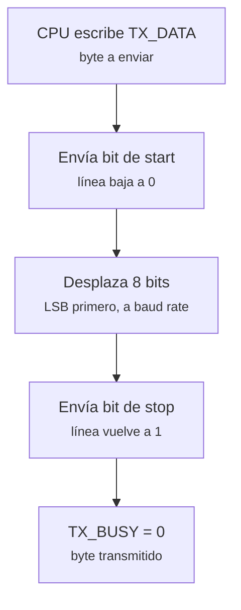
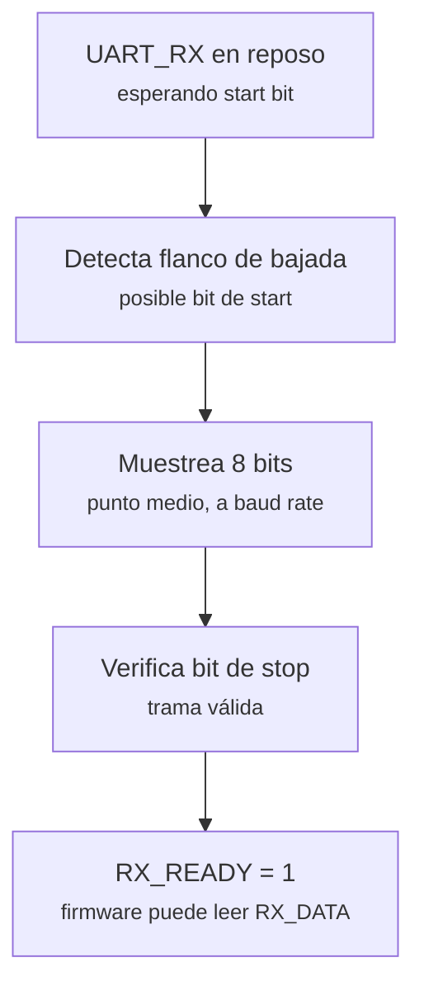
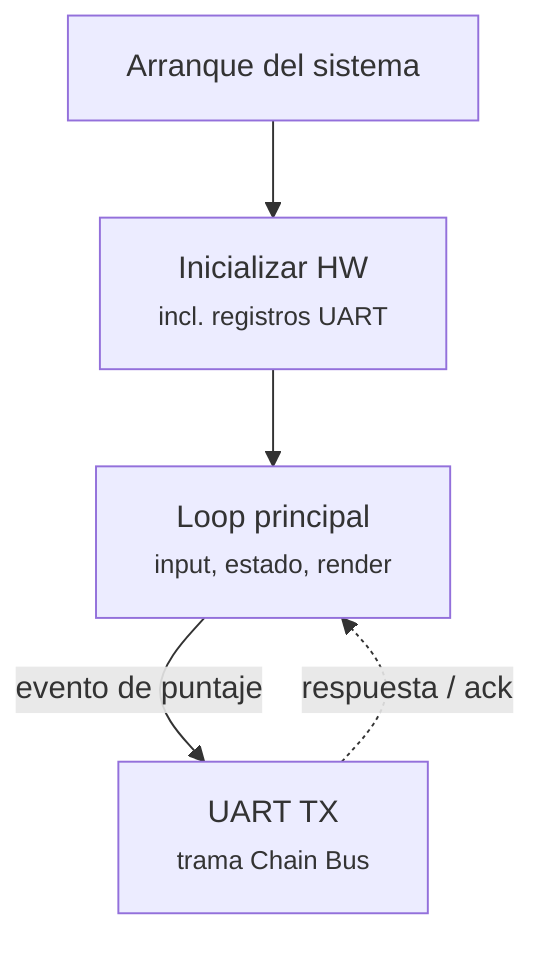
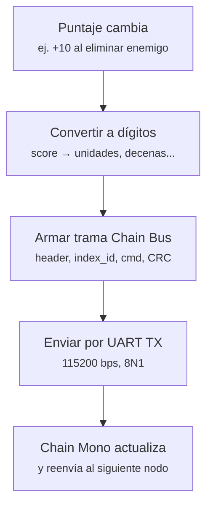

# Protocolo UART

# Periférico UART — Especificación e integración con Chain Mono (M5Stack)

## 1. Objetivo

Especificar cómo el periférico UART, mapeado en `0x400000-0x40FFFF` del SoC del curso, se usará dentro del videojuego para **mostrar el puntaje del jugador** en un arreglo de pantallas **M5Stack Chain Mono** (matrices LED de 8×8 píxeles conectadas en cadena).

Este documento cubre dos capas separadas, porque **no tienen el mismo dueño**:

| Capa | Quién la define | Quién la implementa |
|---|---|---|
| Física (bits UART) | Estándar UART / especificación del curso | Nuestro equipo, en RTL |
| Trama / comandos (Chain Bus) | Fabricante (M5Stack) | Nuestro equipo, en firmware C, siguiendo su especificación |

---

## 2. Capa física: protocolo UART

### 2.1 Parámetros

- Formato: **8N1** (8 bits de datos, sin paridad, 1 bit de stop)
- Velocidad: **115200 bps** — coincide con la que usa el hardware Chain Mono, así que no hace falta traducir baud rates en el camino.
- Línea en reposo: nivel alto (`1`). Un bit de start es la línea bajando a `0`.

### 2.2 Transmisión (TX)

### 2.3 Recepción (RX)

**Por qué necesitamos RX y no solo TX:** el protocolo Chain Bus del fabricante espera una trama de respuesta por cada comando enviado (`Operation_status`, ver sección 4), así que el FPGA actúa como maestro **full-duplex**, no solo como transmisor [4].

### 2.4 Registros CSR propuestos

| Dirección | Registro | Acceso | Función |
|---|---|---|---|
| `0x400000` | `TX_DATA` | Escritura | Byte a transmitir |
| `0x400004` | `RX_DATA` | Lectura | Byte recibido |
| `0x400008` | `STATUS` | Lectura | bit0 = `TX_BUSY`, bit1 = `RX_READY` |

---

## 3. Dónde encaja UART en el flujo del juego

UART no dispara lógica de juego (a diferencia de PS/2 o NES); es un canal de salida que se activa cuando el estado del juego cambia — en este caso, cuando cambia el puntaje.

---

## 4. Capa de aplicación: protocolo Chain Bus (Chain Mono)

Las pantallas Chain Mono no se controlan mandando bytes arbitrarios: el fabricante define un **formato de trama fijo** encima de los bits UART. Nuestro firmware arma estas tramas; no las inventamos, las seguimos [4].

### 4.1 Formato de trama

| Campo | Tamaño | Descripción |
|---|---|---|
| Cabecera | 2 bytes | fija, `AA 55` |
| Longitud | 2 bytes | tamaño del payload |
| `Index_id` | 1 byte | dirección del nodo en la cadena |
| `Cmd` | 1 byte | comando (ej. `0x10` = fijar modo de pantalla) |
| Payload | variable | datos del comando (ej. coordenadas de píxel) |
| CRC | variable | checksum de la trama |
| Cola | 2 bytes | fija, `55 AA` |

Cada nodo recibe la trama por su conector `IN`, la procesa (o la reenvía si el `Index_id` no le corresponde) y la reenvía por su `OUT` al siguiente nodo — así es como una sola línea UART controla varios módulos en cadena [3].

### 4.2 Topología física

- El FPGA es el **maestro** del bus.
- `UART_TX` del FPGA se conecta al `IN` del primer módulo Chain Mono.
- El `OUT` de cada módulo se conecta al `IN` del siguiente.
- `UART_RX` del FPGA recibe las respuestas que se propagan de regreso por la cadena.

---

## 5. Plan de implementación: mostrar el puntaje

## 7. Fuentes

1. Documento del curso, *"Proyecto PBL — Videojuego en FPGA (Digital 1)"* — mapa de memoria, contrato de puertos CSR y metodología del curso.
2. M5Stack, *"Chain Mono"* (especificaciones del producto: MCU, velocidad UART, interfaces) — https://docs.m5stack.com/en/chain/Chain_Mono
3. M5Stack, *"Chain Series Device Bus Communication Tutorial"* (topología maestro/nodo, reenvío hop-by-hop) — https://docs.m5stack.com/en/arduino/projects/chain/chain_bus
4. M5Stack, *"Protocol Reference — U218 UART"* (formato de trama, tabla de comandos) — https://docs.m5stack.com/en/protocol/U218/UART
5. M5Stack, *"Chain Mono Tutorial"* (uso de la librería M5Chain, ejemplos de control de píxeles) — https://docs.m5stack.com/en/arduino/projects/chain/chain_mono
